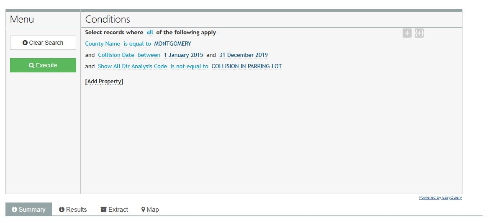
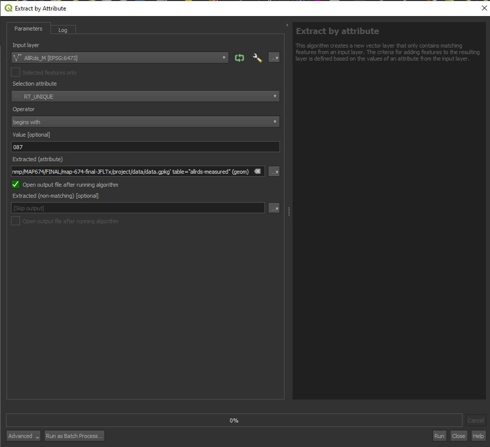
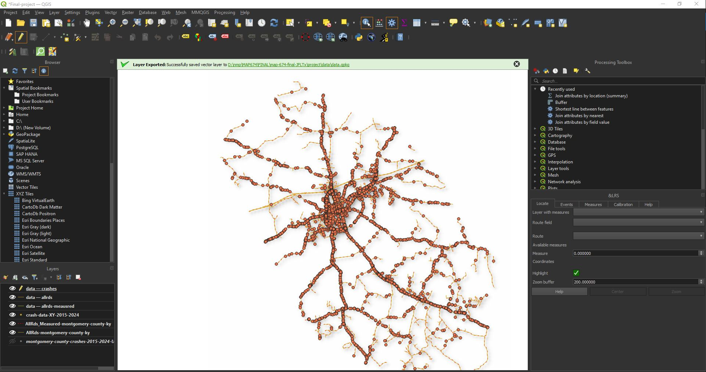
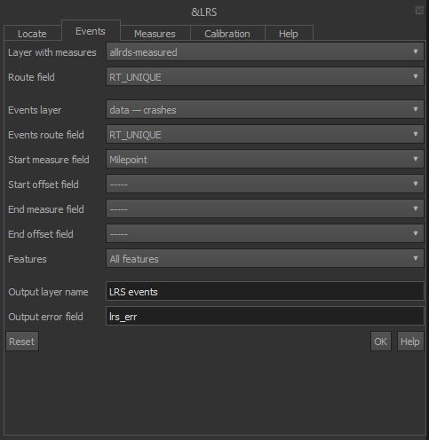
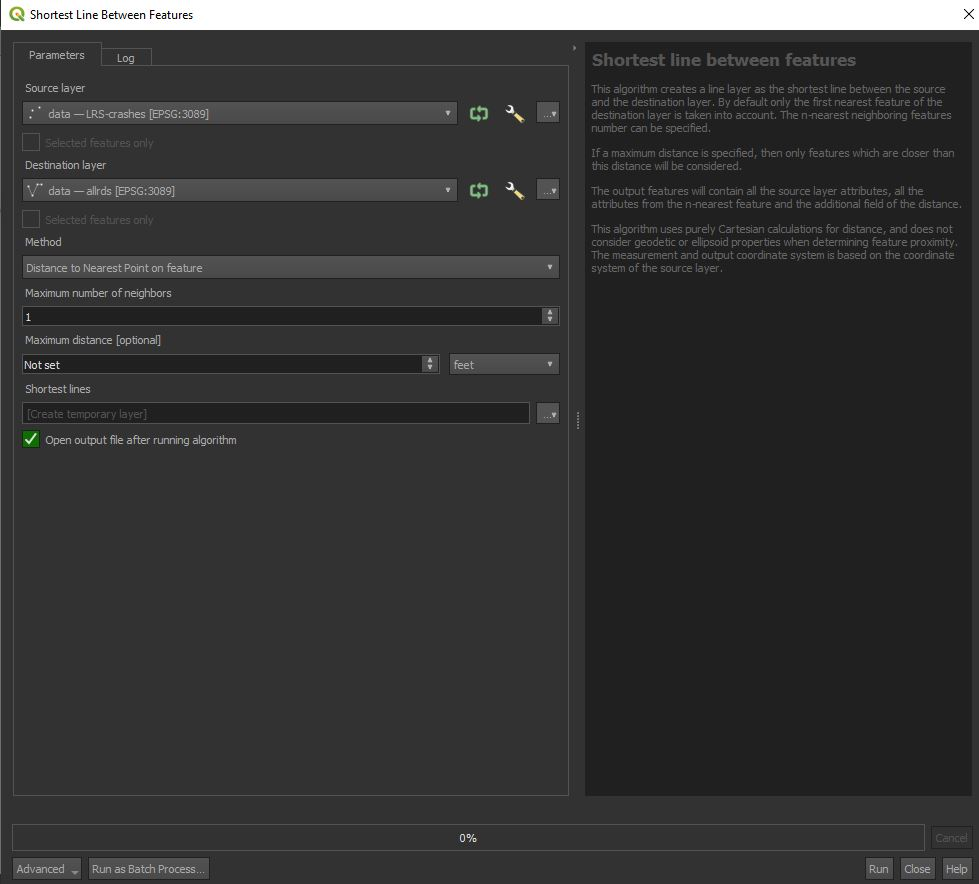
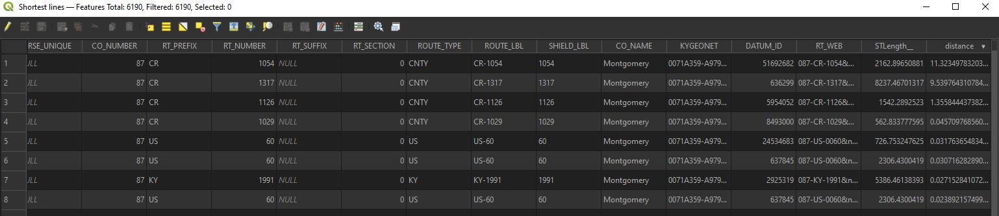
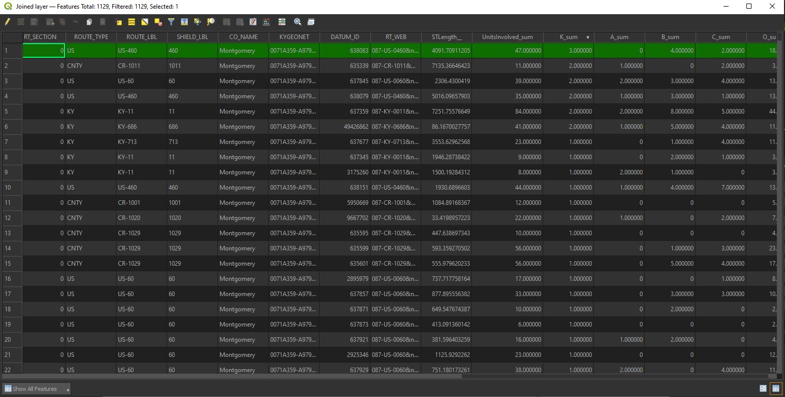
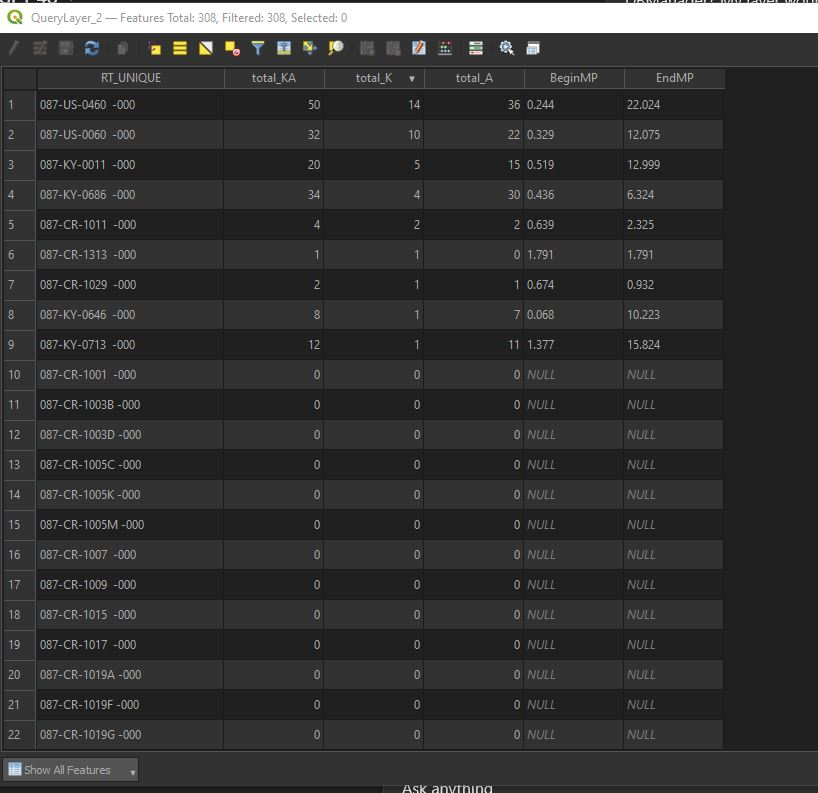
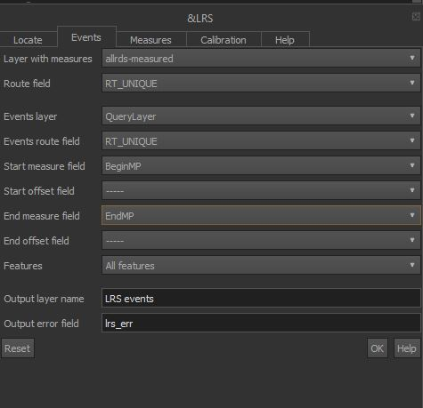
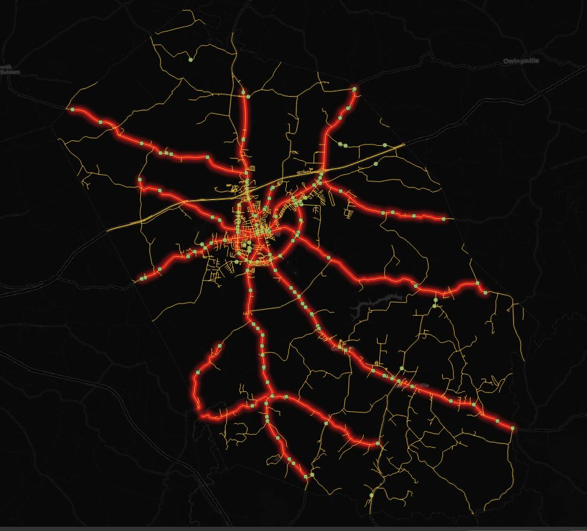

# A SAFETY ANALYSIS OF ROADS IN MONTGOMERY COUNTY, KY

## Introduction

A projected estimate of licensed drivers in the United States in 2025 lists that there are approximately 242.1 million drivers in the united states, which includes over 90% of US residents of driving age (<a href="https://hedgescompany.com/blog/2024/01/number-of-licensed-drivers-us/">source</a>). In April 2025, the US Department of Transportation's National Highway Traffic Safety Administration estimated a projected 39,345 people lost their lives in traffic crashes, with 40,901 people losing their lives in 2023 (<a href="https://www.nhtsa.gov/press-releases/nhtsa-2023-traffic-fatalities-2024-estimates">source</a>). That is over 70,000 individuals who left behind families and loved ones which could easily be prevented. Highway safety is a national concern and is of the utmost importance from the largest urban centers to the smallest towns and cities. 

This analysis is an additional, refined exercise of calculating/identifying problematic roadways in Montgomery County, KY to potentially inform efforts to Montgomery County and Mount Sterling city officials for improving roadways in the community. This geospatial analysis will be performed using QGIS Desktop version 3.34.2.

### Brief description of question of interest

As mentioned above, this analysis aims to find roadways of concern in Montgomery County, KY. While some <a href="https://www.lex18.com/homepage/mt-sterling-roundabout-dedicated-to-teen-killed-in-crash">improvements have been made</a> due to <a href="https://www.wsaz.com/2021/05/16/teen-killed-in-montgomery-county-crash/">traffic fatalities in recent years</a>, there are still more areas that could be identified and improved. In 2023, on Old Owingsville Road, <a href="https://www.wkyt.com/2023/09/29/pedestrian-hit-killed-front-montgomery-co-park/">a man lost his life</a> in an unfortunate incident where he was attempting to return home from walking his dog at Easy Walker Park (within viewing distance from my own home). Most recently, in an extreme case, a <a href="https://www.wkyt.com/2025/04/21/coroner-identifies-person-killed-crash/">local man lost his life</a> on April 19, 2025, leaving behind two young children and a wife. 

This stresses the importance for roadway safety across all communities, as no person of any age, behind the wheel or simply taking a walk, should lose their life in any traffic accident. Identifying these roadways of concern provides a data-driven approach to focus money and efforts in traffic safety enhancements. 

### Spatial data analysis selected with reasoning for selection

Generally, this data analysis will be focusing mostly on a series of spatial joins, properly "tagging" crashes to roadways. Associating these crash types by several types to the roadways can help authorities and engineers to better identify the appropriate safety measures. When millions of dollars are in play, every cent needs to be spent in the best possible way to improve roadway safety. The reason for this analysis is to ensure that there is a proper attribution of problematic roadways instead of doing a visual comparison. Having a weighted approach to this system can help to develop a rudimentary high injury network which is developed to benefit the implementation of these dollars and efforts. 

### Spatial question of interest

Questions I intend to answer in this geospatial analysis: 
 - Where are the most crashes occurring? 
 - What roadways do crashes occur most on in Montgomery County?
 - What roadway types (Kentucky Highway, US Highway, or Local Roads) are crashes occuring most on?
 - What are the rates of crashes by roadway miles? 
 - What are the possible high injury networks in Montgomery County? 

## Dataset Information, Description, and Coordinate Systems

There are several components to this analysis, including crash data and roadway polylines. The [crash data](data/crash-data-XY-2015-2024.geojson), after initial edits and modifications (original dataset downloaded with the below parameters in the screenshot), and exported to a GeoJSON, contain the following: 
- 4.89 MB of total data
- 26 total fields 
- 6,094 total features



For the sake of this analysis, intended on indentifying state, US, and local routes for safety improvements, removes interstate crashes from this analysis and thus is not considered. The data was exported in NAD83 KY Single Zone or EPSG 3089 for consistent use in the geospatial analysis. 

The other two components of this dataset, called AllRds and AllRds_M, were orignally downloaded from [KYTC's DataMart](https://datamart.kytc.ky.gov/), and are used in the final spatial analyses. Additioanlly, for file size constraints, the data was filtered with the following SQL queries and exported to respective GeoJSON files: 

[AllRds](data/AllRds-montgomery-county-ky.geojson):
```sql
"CO_NAME" = 'Montgomery'
```

[AllRds_M](data/AllRds_Measured-montgomery-county-ky.geojson):
```sql
"RT_UNIQUE" LIKE '087%'
```

The SQL Query for AllRds takes any roadway occuring in Montgomery County, KY, while AllRds_M takes any data from the RT_UNIQUE value and returns anything begining with the string '087', which is the county code for Montgomery County. Doing this initially can save massive amounts of file space in the long-term. 

NOTE: this serves as an ammendment to be transparent with my workflow and troubleshooting. Actually preserving the measure attributes/M-Enabled spatial dataset is *CRUCIAL* for this analysis. The data must be exported to a GeoPackage by using the Extract by Attribute tool. To to this, the below screenshot details the inputs you must have for this export to work, and you must save it to a permanent file inside a GeoPackage in your local databse. 



The details for the filtered datasets are as follows: 

AllRds:
- 2.67 MB total data
- 30 total fields
- 2,033 total features

~~AllRds_M:~~
- ~~1.18 MB of data~~
- ~~3 total fields~~
- ~~859 total features~~

AllRds-Measured in a GeoPackage:
- 4.57 MB of data
- 4 total fields
- 859 total features

The coordinate systems used across all datasets are in EPSG 3089, or NAD83 / Kentucky Single Zone (ftUS)

## Spatial data analysis, with step-by-step description

### Loading dataset into program

To start, open a new QGIS project. Let's set the project's coordinate system to match the data in this repository's data folder to EPSG 3089. Hit Ctrl+Alt+P to open the project properties, and in the CRS group, in the search bar, filter out the desired coordinate system to "3089", select the result, and hit "OK". 


Load the aforementioned data in a new QGIS map, choosing it from this repository's data folder. Additioanlly, for geoprocessing speed and ensuring a spatial index is properly generated (you must scropll to the bottom and ensure the "SPATIAL_INDEX" dropdown property is set to "YES"), export the layers [crashes](data/crash-data-XY-2015-2024.geojson), [AllRds](data/AllRds-montgomery-county-ky.geojson), and [AllRds_Measured](data/AllRds_Measured-montgomery-county-ky.geojson) into a new GeoPackage, and name it something appropriate (data.gpkg works!). 

Now to prep the data and ensure the proper data is carried over, we need to calculate new fields in QGIS. We need to take the KABCO column and split the values into their own separate values and return either a 1 or 0 if the value exists. The below SQL calculates a new "K" field and returns a 1 or 0 if KABCO = 'K':

```sql
CASE
  WHEN "KABCO" = 'K' THEN 1
  ELSE 0
END
```

The below screenshot summarizes how this should appear in QGIS, ensuring that the K column returns an integer (super important!).


Repeat this for a column of each A, B, C, and O replacing the expression value 'K' with each respective column you wish to calculate. 

Onto the analysis! Next, we want to create linearly-referenced dataset of crashes. To do this, we need a polyline with measure values, and we need an "event" layer, such as crashes, that have a unique route identifier and a length along that identifier that the event occurs on. Our AllRds_M queried to Montgomery County and our crash database that we generated are those two respective layers that we need. To do this, we need to use a toolset called the LRS toolset. This is a plugin we can install. To do that, click the Plugins tab at the top of your QGIS window, and click "Manage and Install plugins". In the resulting window, in the All tab, search for "LRS" and click the resulting tool, shown in the below screenshot. 


Once the tool is added, you can use it in this step of the analysis. 

The below screenshot is the LRS toolset window, whic happens to be docked to the bottom-right of my QGIS window. You can note several tabs in the LRS toolset window, of which we want to click the Events tab. 



In the events tab, this is where we want to linearly-reference our crashes. The inputs are as follows:
- Layer with meaures: [your filtered allrds-measured layer in a geopackage]
- Route field: "RT_UNIQUE"
- Events layer: [your crash layer in a geopackage]
- Events route field: "RT_UNIQUE"
- Start measure field: "Milepoint"

The below screenshot summarizes these inputs. Optionally, it is recommended that you create an output error field to show if the points were placed on the line without issue or not. 



If you like it, then you can export the linearly-referenced crashes to your GeoPackage and we can put a ring (buffer) on it! But first, we need to calculate the distance to the nearest feature using the Shortest Line between Features tool to draw a line from the LRS crashes to the nearest line/roadway. The below gives that input. There is no need to permanently save this dataset. 



To clarify: 
- we do not want to draw more than a single line from each point to the nearest line. Each accident occurs on ONE roadway each time it happens, even at an intersection (technically, right?)
    - While the assignment of that roadway can be tricky and imperfect from local authorities, it is best to not try to correct it. 
- We also want no maximum search distance specified. The lines *technically* are overlapping the roadway lines at this point, however, there is still some discernable distance between each point and the line itself. 
- We will use this maximum distance calculated as our buffer inputs. Beyonce would be proud of our rings. 

After running this tool you should have some seemingly invisible lines. However, open the attribute table on the output feature and scroll to the very far right of the attribute table to find the "distance" column. Sort the options by descending and take note of the maximum distance listed, of which my results yield ~11 feet of distance. So, our buffer distance should be no less than the next highest rounded whole number of 12 feet. This should create a buffer large enough on our point that we can then spatially associate with our lines. 



Now, in your processing toolbox, search for the buffer tool. Our inputs are as follows:

- input layer (our layer we want to buffer): [your LRS Crashes layer in your geopackage]
- Distance: 12 feet
- Segments: 1
- End Cap Style: Round


Run the tool. Visually inspect the output and ensure each buffer you choose appears to overlap your AllRds layer (not AllRds_M/Measured). Also open your buffer output's attribute table and inspect the attributes. You will note that the attributes of our LRS crashes persisted to our buffer layer, which is exactly what we want! 

Now, there is a bit of an additional step involving Python to get the desired joined layer. If you inspect the map, you will notice that at certain intersections, there are buffer areas that overlap more than one road line. This is not what we want! Curses! 

We will have to ensure that our RT_UNIQUE value in our buffer layer ONLY INTERSECTS our allrds layer where there are matching RT_UNIQUE values. If you open the python console, and run each line/segment of the below code, you will get a temporary output with the correct information!

```python
# Step 1: Load the buffers layer and collect RT_UNIQUE values
buffers_layer = QgsVectorLayer(
'[C:\\your\\filepath\\to_your\\gpkg|layername=yourbufferslayer]', 'ogr')

rtUniqueVals = list(set(f['RT_UNIQUE'] for f in buffers_layer.getFeatures() if f['RT_UNIQUE'] is not None)) # gets each RT_UNIQUE value in a list if it is not empty/Null
formattedVals = ["'{}'".format(val) for val in rtUniqueVals] # properly formats RT_UNIQUE values in the list to be wrapped in quotes without throwing errors
expr = '"RT_UNIQUE" in ({})'.format(", "join(formattedVals))

# Step 2: filter the allrds layer using the matching RT_UNIQUE values
allrdsFiltered = processing.run("native:extractbyexpression", {
    'INPUT': 'C:\\your\\filepath\\to_your\\gpkg|layername=allrds',
    'EXPRESSION': expr,
    'OUTPUT': 'memory:allrdsFiltered'
})['OUTPUT']

# Step 3: run spatial join by location summary
results = processing.run("native:joinbylocationsummary", {
    'INPUT': allrdsFiltered,
    'PREDICATE': [0],  # intersects
    'JOIN': '[C:\\your\\filepath\\to_your\\gpkg|layername=yourbufferslayer]',
    'JOIN_FIELDS': ['UnitsInvolved', 'K', 'A', 'B', 'C', 'O'], # snagging units involved to see number of cars that have historically crashed on roadways
    'SUMMARIES': [5],  # SUM
    'DISCARD_NONMATCHING': False,
    'OUTPUT': 'memory:joined_result'
})['OUTPUT']

# Step 4: Add results to the map
QgsProject.instance().addMapLayer(results)
```

Your output should now have those five fields summarized, which appear similar to the below screenshot. Export your results to your geopackage and as a GeoJSON for awesome web mapping!



### Computing summary statistics

Now let's calculate the rate of crashes per mile of roadway for each segment. To do this, let's calculate a new field in our geopackage that returns the length of each roadway segment in miles:

```sql
 "STLength__" / 5280
```

The field STLength__ is already the length of each line segment in feet, which we then convert to miles by dividing by 5280. 

Next, we can use our data to find a high injury network. *NOTE*: this is the first time I am running this sort of analysis. So it is a bit new to me. To do this, we are going ot use the Database Manager option and some SQL querying in QGIS. 

To develop this, we have to summarize the number of K crashes, the number of A crashes, the number of KA total crashes, and the minimum and maximum milepoint each of these occur on *per RT_UNIQUE value*. So We can fund the RT_UNIQUE value, summarize a K + A field, add up all the K crashes, the A crashes, and find the mimimum and maximum values these occur on. That SQL in the DB Manager is as follows: 

```sql
SELECT 
  "RT_UNIQUE",
  SUM("K" + "A") AS total_KA,
  SUM("K") AS total_K,
  SUM("A") AS total_A,
  MIN(CASE WHEN "K" > 0 OR "A" > 0 THEN "Milepoint" END) AS BeginMP,
  MAX(CASE WHEN "K" > 0 OR "A" > 0 THEN "Milepoint" END) AS EndMP
FROM "your-crash-name"
GROUP BY "RT_UNIQUE"
```

The output should generate something like the below screenshot, where US 460 (RT_UNIQUE 087-US-0460  -000) has 50 total KA crashes in a nearly 22 mile segment of highway. 



Remeber the LRS toolset we used earlier? Well, we can use this table that was generated to our map to drape overtop of our AllRds_Measured line in our geopackage! Neat! The below screenshot should give you those inputs on overlaying a line on top of another line. It is not just points! *NOTE*: you will need to filter out anything showing less than two KA crashes, as it iwll mess up your results. 



And the result is the below screenshot! 



The red line is our rudimentary high injury network, and the points show are either a K crash (fatal) or A crash (serious injury crash). 

Additionally, we can sum up the total crashes per roadway/RT_UNIQUE with the following query in the DB Manager: 

```sql
SELECT 
  "RT_UNIQUE",
  SUM("K") AS total_K,
  SUM("A") AS total_A,
  SUM("B") AS total_B,
  SUM("C") AS total_C,
  SUM("O") AS total_O,
  SUM("K" + "A" + "B" + "C" + "O") AS total_crashes
FROM "LRS-crashes"
GROUP BY "RT_UNIQUE"
```

With the resulting table giving a summary of total crashes and crash severities by each roadway. But what about the total crashes per roadway type? 

```sql
SELECT 
  "ROUTE_TYPE",
  SUM("IncidentCount") AS total_crashes
FROM "joined_roads"
GROUP BY "ROUTE_TYPE"
ORDER BY total_crashes DESC
```

Gives the following results in a table: 

|ROUTE_TYPE|total_crashes|
|----------|-------------|
|KY        |2978         |
|US        |2567         |
|CITY      |1275         |
|CNTY      |1074         |
|PRIV      |249          |
|LOCA      |6            |

The above table verifies that Kentucky and US Highways are of the utmost priority to reduce traffic accidents in Montgomery County. Alongside the use of the High Injury Network, we can discern the most important roadway corridors to focus highway safety improvements.

### Interpreting spatial analysis results

With the resulting data analysis, there are some problematic roadways of concern, of which some are going to be a priority for improvements: 
- Indian Mound Drive from approximately milepoint 0.000 to milepoint 1.656 (intersetion of US 60 and Indian Mound Drive).
- Indian Mound Drive from approximately milepoint 2.195 (intersection of Alliance Drive and Indian Mound Drive) to milepoint 3.506 (intersection of Indian Mound Drive and Camargo Road/US 460).
- Camargo Road (US 460) from milepoint 10.700 to milepoint 15.143. 
- US 460 from milepoint 16.44 to milepoint 17.505.
- Levee Road from milepoint 0.439 to milepoint 9.233.
- Maysville Road from milepoint 7.316 to 8.297 (This section of US 460 can be added by having the begin/end milepoint values attributed to the RT_UNIQUE 087-US-460  -000).
- Hinkston Pike from milepoint 0.000 to milepoint 1.344. 
- US 60 from milepoint 0.329 to milepoint 4.311 (intersection of US 60 and Indian Mound Drive).
- US 60 from milepoint 7.185 to milepoint 8.574 (I-64 EB Ramp). 

While those may be the more concerning roadways, all of the initially prepared high injury network will be proposed as significant enough for city and county officials to use to implement a data-driven approach to roadway safety improvements. It is my hope and desire to inform city officials where they should be focusing efforts to make highway safety a priority for residents and visitors in Montgomery County!

## Map

### The map as an image file

### Description in text of how the map includes the spatial analysis results

### Discussion of mapping decisions made that highlights the spatial results

### Consider the questions: What worked well? What didn't? What could be tried in the future?
